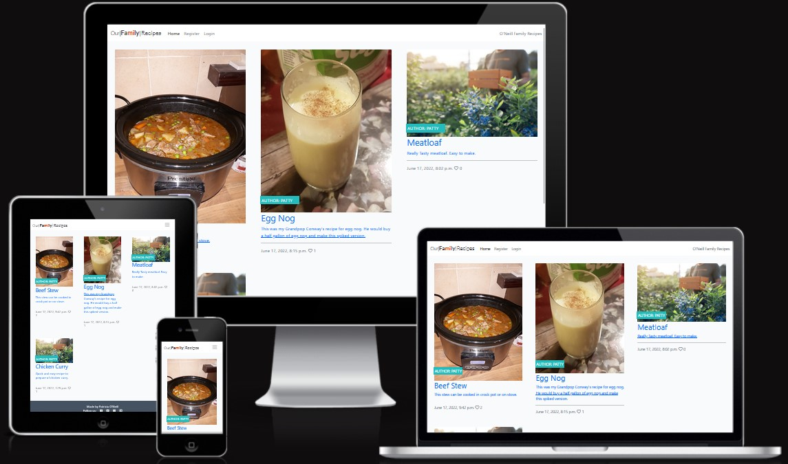
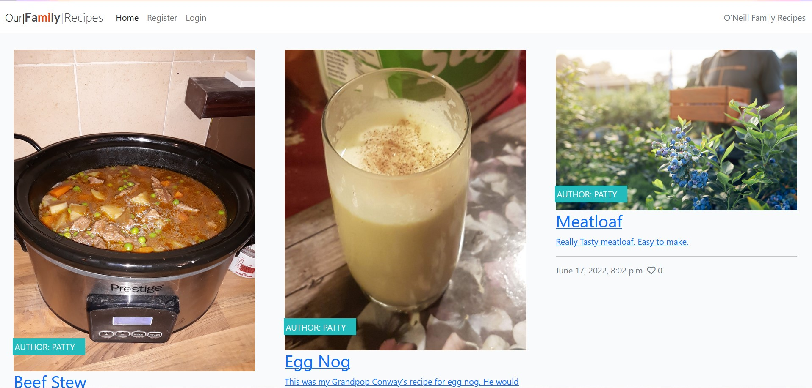
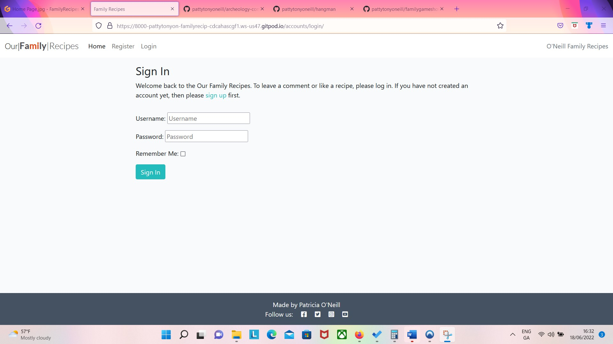
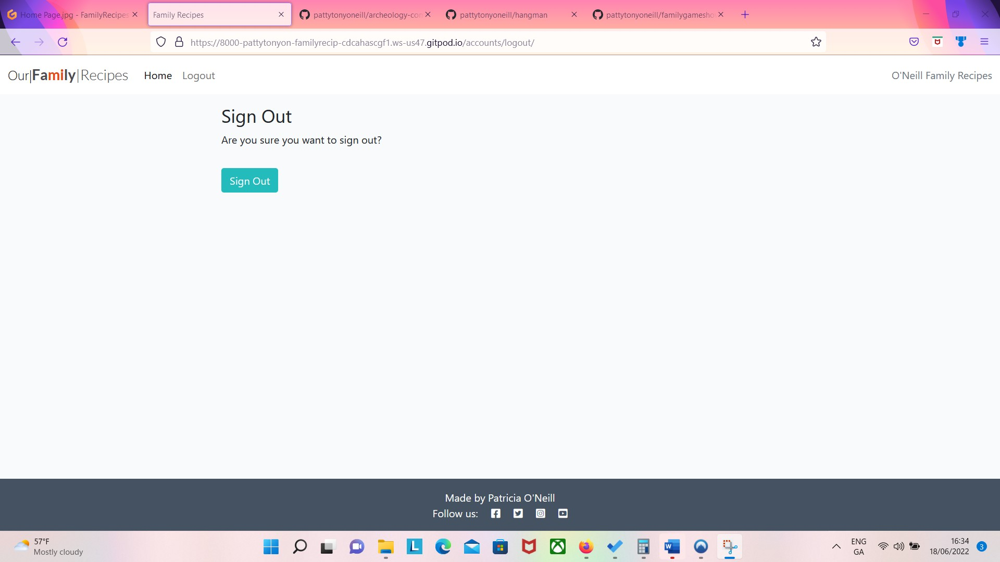
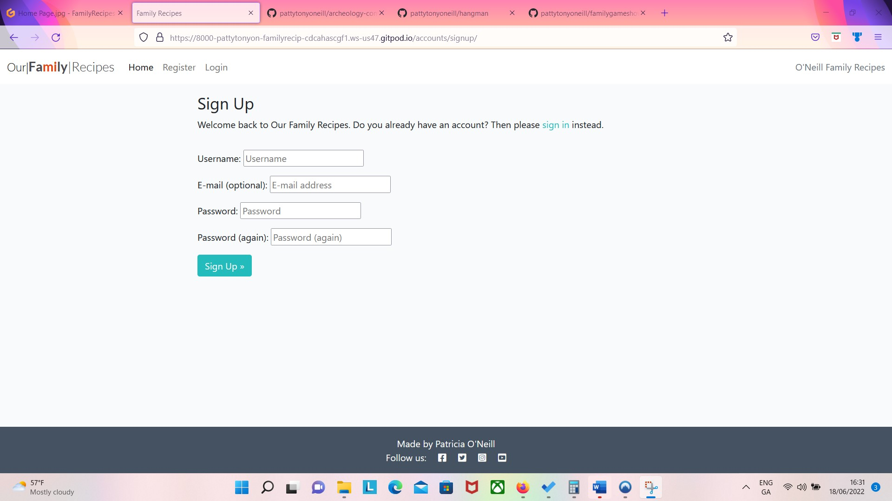
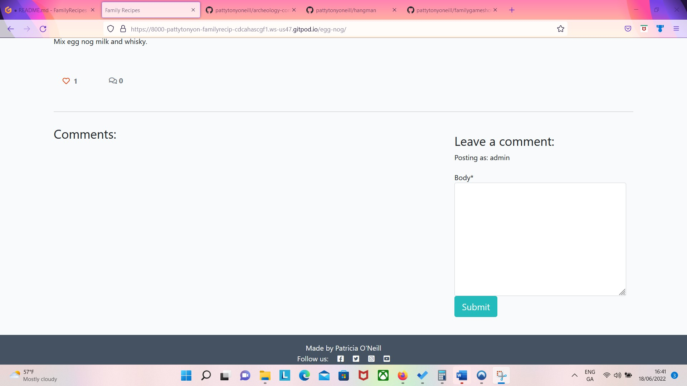

# [Our Family Recipes]
- 
## Visit the live Website : **[Family Recipes :arrow_right:](https://family-recipes14.herokuapp.com/)**
- Family Recipes that are to be shared amoung family and friends.
- Users will be able to comment on and add useful suggestions of ways that the recipe can be improved.

User Stories:
- _First time Visitor Goals_
  - As a first time user of this site, I would like to be able to easily create a draft of a recipe.
  - As a first time user, I would like to be able to comment on recipes.
  - As a first time user, I would like to Like/Unlike the recipes.
  - As a first time user, I would like to be able to view likes.
  - As a first time user, I would like to view comments on the recipes.
  - As a first time user, I would like to easily register.
  - As a first time user, I would like to view a paginated list of recipes so that I can select which post I want to view.

## Existing Features
- Interactive Elements:
  - Home page
    - 
  - Login/Logout
    - 
    - 
  - Register
    - 
  - Like
    - 
  - Comment
    - 
-

## Languages Used:

- Python
- Django
- HTML
- CSS
- JavaScript

## Relational Database used:

- Postgres

## Frameworks, Libraries & Programs Used:

- [Git](https://git-scm.com): used to utilize the Gitpod terminal to commit to Git and Push to GitHub
- [GitHub](https://github.com/): used to store project code after being pushed from Git
- [GitPod](https://gitpod.io/): used as cloud based IDE for writing code
- [Balsamiq Wireframes](https://balsamiq.com/):  used to draw wireframes of pages of project
- [Am I Responsive?](http://ami.responsivedesign.is/) used to give a visual of what the project looks like on various devices
- [Heroku](https://heroku.com): used to deploy the Our Family Recipes app
- [Cloudinary](https://cloudinary.com/): used to import my Cloudinary field for the featured image
- [Diffchecker](https://www.diffchecker.com/): used to compare code when I had an error

### Wireframes
To view all wireframes, go to [WIREFRAMES.md](WIREFRAMES.md)

## Deployment

- The site was deployed to Heroku. I used the steps listed below to deploy. 
  -  Fork or clone this repository
      -  `git clone https://github.com/pattytonyoneill/Family-Recipes.git`
  -  Register in [Heroku.com](https://www.heroku.com)
  
  -  Create a new Heroku app. 
  -  Under "Settings" set buildback to **python**.
  -  Under "Settings" set buildback to **nodeJS**.
  -  Under "Settings" click "Reveal Config Vars", Set `PORT` to `8000`
  -  Link the app to the repository.
  -  Click on Deploy
    -  select github
    -  find repo
    -  click connect button
    -  enable automatic deployment
    -  deploy branch
    -  allow a few minutes for the app to build
    -  then it deploys with live link

The live link can be found here - https://family-recipes14.herokuapp.com/

## Future Additions to page
- put drop down menu to have user choose minutes and hours for the cooking time and prep time
- put drop down menu to have user choose measurement type
- have measurements able to be converted from metric to US standard
- add ability to put fractions in recipes

## Credits
-  [Create a Recipe App](https://engineertodeveloper.com/getting-started-with-django-forms-create-a-recipe-app/)
-  
-  

### Code
- _Readme used sample readme from code institute as a model. [Github](https://github.com/Code-Institute-Solutions/readme-template/blob/master/README.md)_

### Content
- _All content written by the developer._

### Acknowlegements
- _My Mentor for his help and feedback._
- _Tutor support at Code Institute_
- _Family for help with help and feedback on website as a user_

#### Testing

To view all testing, go to [TESTING.md](TESTING.md)